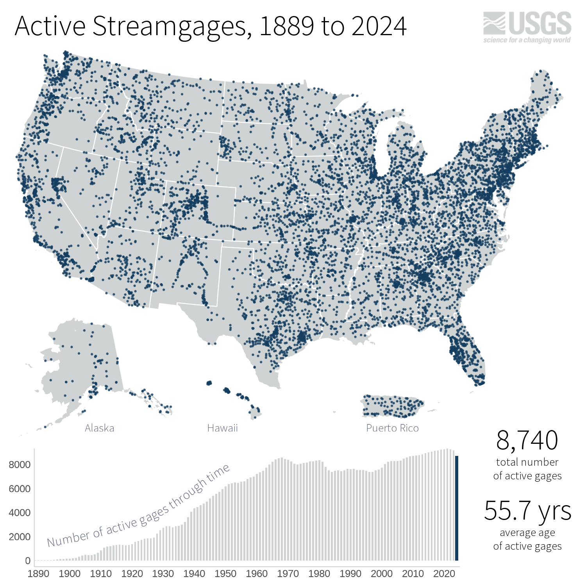

# Gages Through the Ages Visualization

## The Purpose
The Gages Through the Ages Visualization presents the viewer with a brief history of the U.S. Geological Survey's (USGS) streamgaging efforts from the placement of the first USGS gage at Embudo, New Mexico in 1889 to the present day.

## The Code
The project is Open Source and uses the Vue JavaScript framework in conjunction with animated Scalable Vector
Graphics (SVG) and raster graphics. The build process uses the Jenkins task 
runner and Docker containerization.

## To build the website locally
Clone the repo. In the directory, run `npm install` to install the required modules. This repository requires `npm v20` to run. If you are using a later version of `npm`, you may [try using `nvm` to manage multiple versions of npm](https://betterprogramming.pub/how-to-change-node-js-version-between-projects-using-nvm-3ad2416bda7e).

Once the dependencies have been installed, run `npm run dev` to run the site locally from your browser (the local web address will show on completion).
 